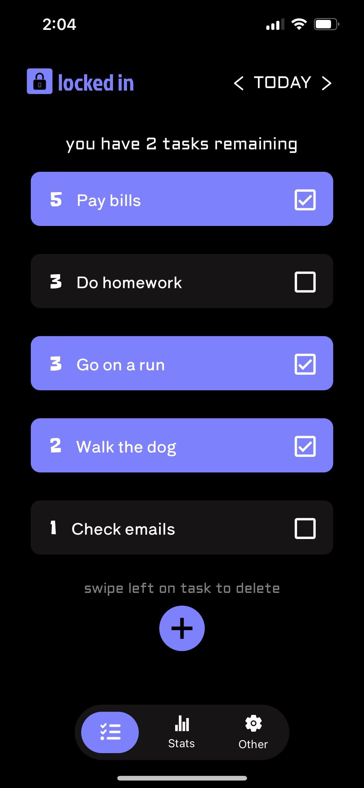
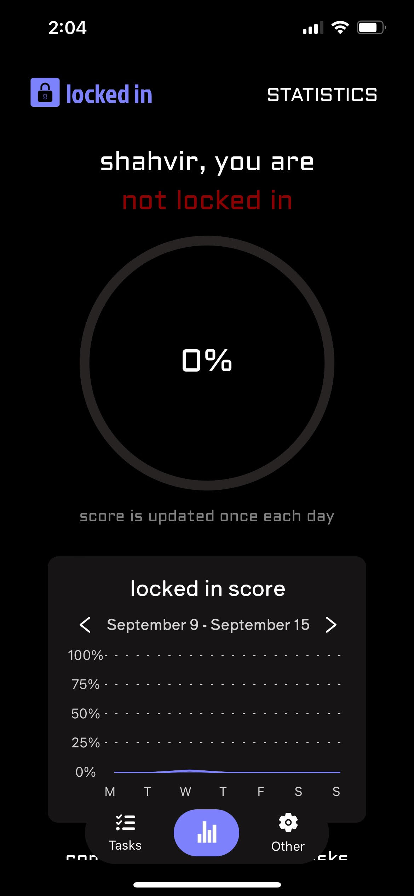
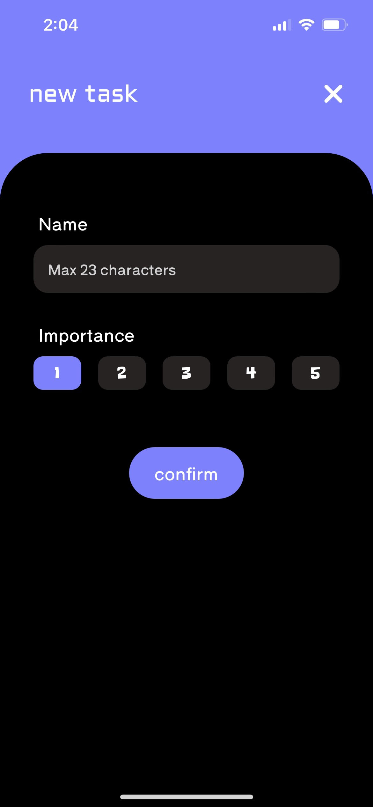
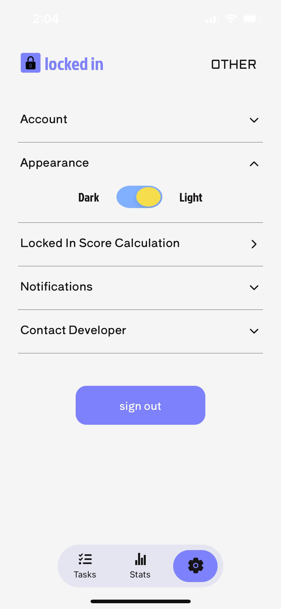

# Locked In

Struggling to get things done!? Having a hard time staying consistent!? Then, Locked In is the right app for you!

Locked In is a mobile application created using React Native. It is a task completion 
tracker that gives you a score out of 100 based on the number of tasks you complete and the number of days you
complete them. It basically determines if you are "Locked In" or not 😅!

## Description

Tasks are duplicated from the day before. Tasks can also be added or deleted, and a complete history of previous tasks can be viewed.
Light theme and Dark theme are available!

Some screenshots from the application:






## Getting Started

Locked In will be launched to the App Store very soon!

To run the program:

1. Clone the repository:

 ```git clone https://github.com/shahvir-w/Locked-In.git
 cd Locked-In
 ```

2. Set up the environment and install dependencies:
- If you haven't already, install Node.js.
- Then, make sure you have Expo CLI installed. If it's not installed, run:
 
 ```npm install -g expo-cli
 ```

- Now, to start the project, run:
 
 ```npx expo start
 ```

3. Running on a Device
You can run the app on your mobile device by downloading the Expo Go app from the App Store or Google Play. Once you have it, scan the QR code displayed in the Expo developer tools to run the app on your device.